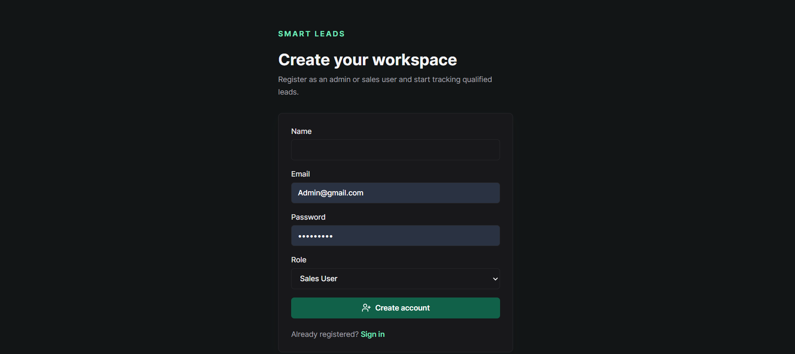
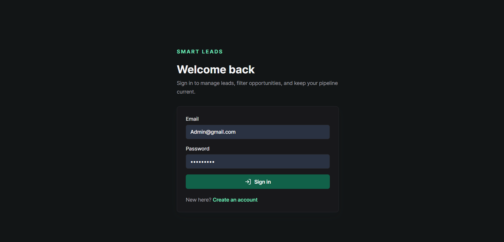
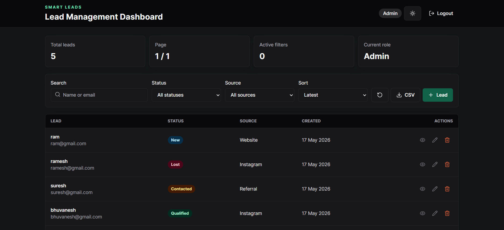
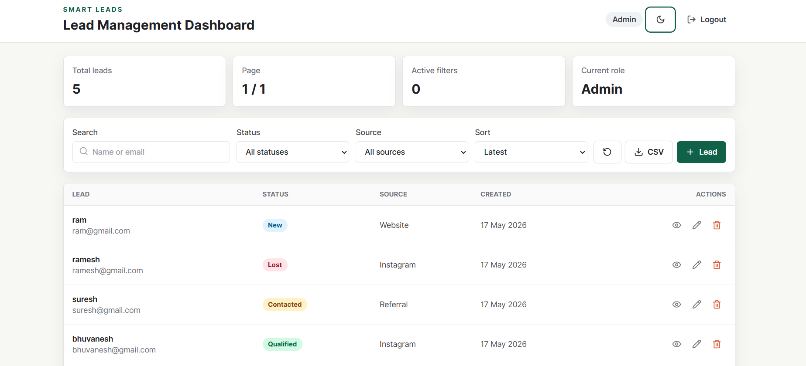
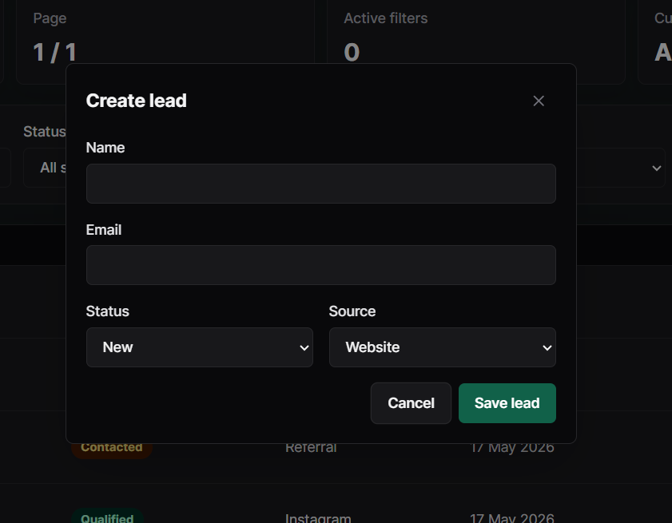

# Smart Leads Dashboard

A full-stack Lead Management Dashboard built using the MERN stack with TypeScript, secure JWT authentication, role-based access control, advanced filtering, pagination, CSV export, and responsive UI.

## Live Demo

### Frontend

[https://smart-leads-dashboard-client.vercel.app](https://smart-leads-dashboard-client.vercel.app)

### Backend API

[https://smart-leads-dashboard-f4eh.onrender.com](https://smart-leads-dashboard-f4eh.onrender.com)

---

# Features

## Authentication & Security

* JWT-based authentication
* User registration and login
* Protected API routes
* Password hashing using bcrypt
* Role-based access control

  * Admin
  * Sales User
* Secure API middleware
* Rate limiting using express-rate-limit
* Helmet security middleware

---

## Lead Management

* Create leads
* Update leads
* Delete leads
* View lead details
* Responsive leads table
* Status tracking
* Source tracking

### Lead Fields

* Name
* Email
* Status

  * New
  * Contacted
  * Qualified
  * Lost
* Source

  * Website
  * Instagram
  * Referral
* Created At

---

# Advanced Features

## Filtering & Search

* Filter by status
* Filter by source
* Search by name or email
* Sort by latest or oldest
* Multiple filters work together

## Pagination

* Backend pagination using skip and limit
* Pagination metadata support
* Next/Previous navigation

## CSV Export

* Export leads into CSV format

## Debounced Search

* Optimized search requests using debouncing

## Dark Mode

* Persistent dark/light theme support

---

# Tech Stack

## Frontend

* React.js
* TypeScript
* Vite
* Tailwind CSS
* Axios
* Lucide React

## Backend

* Node.js
* Express.js
* TypeScript
* MongoDB Atlas
* Mongoose
* JWT Authentication
* bcryptjs

## Deployment

* Frontend: Vercel
* Backend: Render
* Database: MongoDB Atlas

---

# Project Structure

```bash
Smart-Leads-Dashboard/
│
├── client/
│   ├── src/
│   │   ├── components/
│   │   ├── context/
│   │   ├── hooks/
│   │   ├── lib/
│   │   ├── pages/
│   │   ├── types/
│   │   └── styles/
│
├── server/
│   ├── src/
│   │   ├── config/
│   │   ├── controllers/
│   │   ├── middleware/
│   │   ├── models/
│   │   ├── routes/
│   │   ├── validators/
│   │   └── utils/
│
└── README.md
```

---

# Environment Variables

## Backend `.env`

```env
PORT=5000
MONGO_URI=your_mongodb_connection_string
JWT_SECRET=your_jwt_secret
JWT_EXPIRES_IN=7d
CLIENT_URL=http://localhost:5173
```

## Frontend `.env`

```env
VITE_API_URL=http://localhost:5000
```

---

# Installation & Setup

## Clone Repository

```bash
git clone https://github.com/your-username/smart-leads-dashboard.git
```

```bash
cd smart-leads-dashboard
```

---

# Backend Setup

```bash
cd server
npm install
```

Run backend:

```bash
npm run dev
```

---

# Frontend Setup

```bash
cd client
npm install
```

Run frontend:

```bash
npm run dev
```

---

# API Endpoints

## Authentication

### Register

```http
POST /api/auth/register
```

### Login

```http
POST /api/auth/login
```

### Current User

```http
GET /api/auth/me
```

---

## Leads

### Get Leads

```http
GET /api/leads
```

### Create Lead

```http
POST /api/leads
```

### Update Lead

```http
PATCH /api/leads/:id
```

### Delete Lead

```http
DELETE /api/leads/:id
```

---

# Production Deployment

## Frontend Deployment

* Vercel

## Backend Deployment

* Render

## Database

* MongoDB Atlas

---
# Screenshots

## Register Page



## Login Page



## Dashboard Dark Mode



## Dashboard Light Mode



## Create Lead Modal



---

# Security Features

* JWT Authentication
* Protected Routes
* Password Hashing
* Secure Headers using Helmet
* Request Rate Limiting
* Environment Variables Protection
* Centralized Error Handling

---

# UI Features

* Responsive Dashboard
* Dark Mode
* Loading States
* Error Handling UI
* Empty States
* Reusable Components
* Accessible Forms

---

# Future Improvements

* Email notifications
* Activity logs
* Lead analytics dashboard
* Team management
* Real-time updates
* File attachments

---

# Author

Lalith Kumar

GitHub: [https://github.com/lalith0317](https://github.com/lalith0317)

---

# License

This project was built as part of a Full Stack Internship Assignment.
